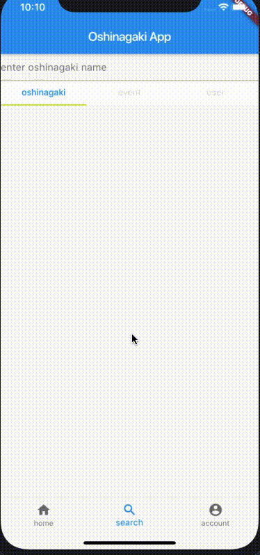

# oshinagaki_beta
## demo

## 概要
技術書店とかコミケとかのお品書き投稿サイト．

## 詳細
- 使用したStateManagement
  - bloc(rxdart + provider)
    - この手のアプリはWeb版も必要なのでBLoCで書けばコードが再利用できるため．
    - 現段階ではStateの流れがかなりシンプルだったのでScopedModelでもよかったかもしれないが，今後複雑になってきた場合はBLoCの方が保守・拡張しやすいと思ったため．
    - 新たにお品書きを追加するページはStatefulWidgetを使用したのは目をつぶっていただきたい:bow:
      - Formに記入された内容をBLoCで管理するのは無駄な気がしたため

## できてないこと
- UIを綺麗にする
- BottomBarを固定してページを遷移する
- バックエンド
